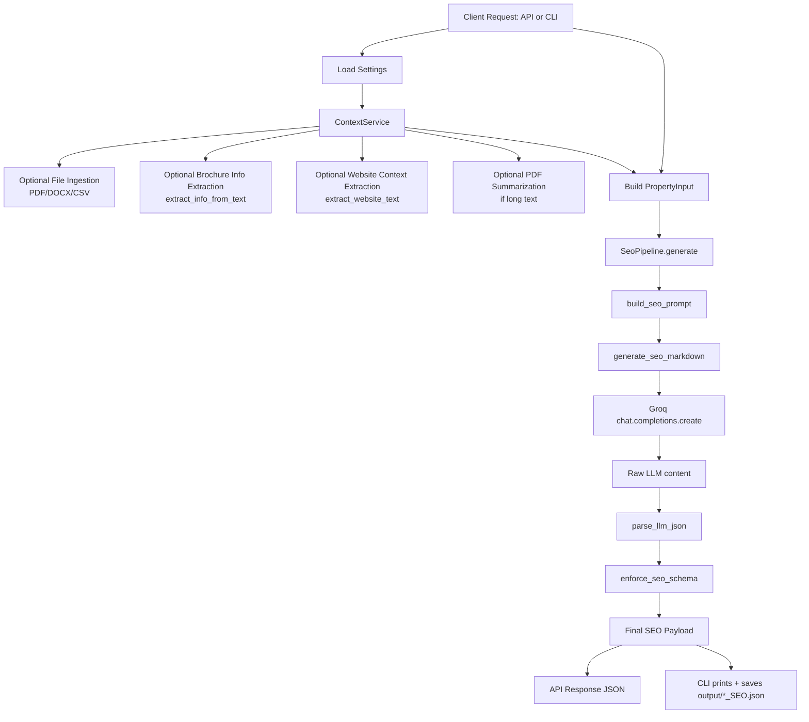

# SEO Property Content Generator

This project generates structured real-estate SEO content as JSON using user inputs plus optional brochure and website context.

## What It Does
- Accepts property details from API form input or CLI prompts.
- Optionally reads context from a brochure file (`.pdf`, `.docx`, `.csv`).
- Optionally scrapes property website text from a URL.
- Builds a constrained SEO prompt and calls Groq LLM.
- Parses and normalizes LLM output into a fixed JSON schema.

## Entry Points
- API server app: `api_app.py` -> `src.seo_app.api:app`
- CLI app: `app.py` -> `src.seo_app.cli:main`

## High-Level Architecture

```text
API/CLI -> ContextService -> SeoPipeline -> PromptBuilder -> Groq LLM
                                        -> JSON Parse/Schema Enforce -> Final SEO JSON
```

## Complete End-to-End Flow



## Detailed Connection Between Modules

### 1) Request Layer
- **API (`src/seo_app/api.py`)**
  - Exposes `POST /seo/generate`.
  - Validates URL format.
  - Builds `Settings`, `ContextService`, `SeoPipeline`.
  - Processes optional file upload.
  - Creates `PropertyInput` and calls pipeline.

- **CLI (`src/seo_app/cli.py`)**
  - Collects user input interactively.
  - Optionally reads local file context.
  - Calls pipeline.
  - Writes result to `output/<project>_SEO.json`.

### 2) Context Layer (`src/seo_app/services/context_service.py`)
- Reads file text:
  - PDF -> text extraction (then optional summarization)
  - DOCX -> paragraph join
  - CSV -> dataframe to string
- Extracts structured hints from brochure text via `info_extractor.py`.
- Scrapes website text via `extractors/url.py`.
- Returns safe fallbacks (`""` or `{}`) if extraction fails.

### 3) Pipeline Layer (`src/seo_app/services/seo_pipeline.py`)
`SeoPipeline.generate(...)` orchestrates generation:
1. Build final prompt using:
   - user fields
   - brochure excerpt
   - website excerpt
2. Call LLM through `seo_generator.py`.
3. Parse returned JSON.
4. Enforce schema and normalize values.

### 4) Prompt Construction (`src/seo_app/services/prompt_builder.py`)
- Creates a strict instruction block:
  - Respond only with JSON.
  - Use a fixed SEO schema.
- Injects all user and context fields into prompt text.
- Caps brochure/website context used in prompt (first 6000 chars each).

### 5) LLM Call Layer (`src/seo_app/services/seo_generator.py`)
- Sends one chat completion request via Groq SDK.
- Returns assistant message content as string.
- If content is `None`, returns empty string.

### 6) Output Safety Layer (`src/seo_app/services/seo_schema.py`)
- `parse_llm_json`: extracts JSON object from raw content.
- `enforce_seo_schema`: guarantees all expected keys exist.
- Normalization includes:
  - list/text cleaning
  - slug formatting (`lowercase-hyphenated`)
  - `meta_description` trimming to max length.

## Output Schema
The final payload always contains these keys:
- `seo_title`
- `meta_description`
- `slug`
- `intro_paragraph`
- `key_features` (list)
- `amenities_section`
- `usp_highlights_section`
- `target_audience_section`
- `location_advantages` (list)
- `call_to_action`
- `suggested_keywords` (list)

## Error Behavior
- Invalid URL in API: HTTP `400`.
- File processing failure in API: HTTP `400`.
- Missing `GROQ_API_KEY`: config error, API `500` / CLI exit `1`.
- Extraction/scraping failures: soft-fail (empty context) where possible.
- LLM/JSON parse failures: generation fails and surfaces as API `500` / CLI error.

## Local Run

### 1) Install dependencies
```bash
pip install -r requirements.txt
```

### 2) Set environment variable
Create `.env` with:
```env
GROQ_API_KEY=your_key_here
```

### 3) Run API
```bash
uvicorn api_app:app --reload
```

### 4) Run CLI
```bash
python app.py
```

## Request/Response Summary
- **Input**: Property fields + optional file + optional URL.
- **Processing**: Context extraction -> prompting -> LLM generation -> schema enforcement.
- **Output**: Consistent SEO JSON suitable for API consumers or saved artifacts.
