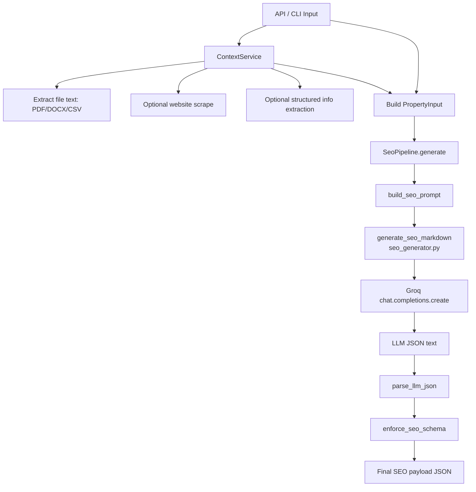

```mermaid
flowchart TD
A[API / CLI Input] --> B[ContextService]
B --> B1[Extract file text: PDF/DOCX/CSV]
B --> B2[Optional website scrape]
B --> B3[Optional structured info extraction]

A --> C[Build PropertyInput]
B --> C

C --> D[SeoPipeline.generate]
D --> E[build_seo_prompt]
E --> F[generate_seo_markdown<br/>seo_generator.py]
F --> G[Groq chat.completions.create]
G --> H[LLM JSON text]

H --> I[parse_llm_json]
I --> J[enforce_seo_schema]
J --> K[Final SEO payload JSON]

```